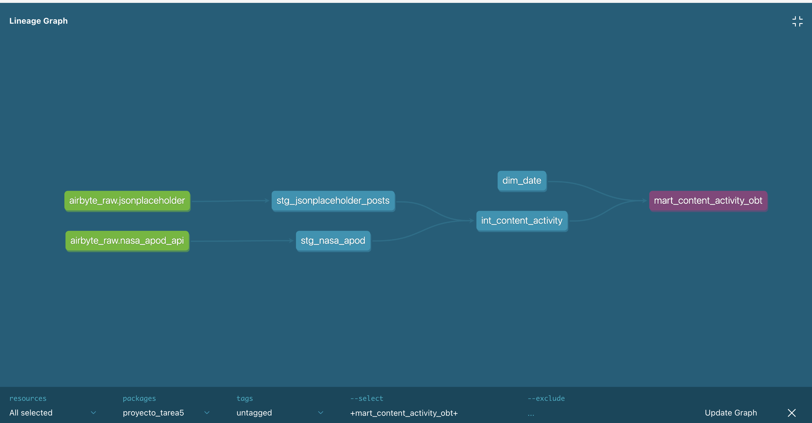

# Tarea 5 - Proyecto dbt con 3 capas (Airbyte + MotherDuck)

## Descripción

En esta tarea se desarrolló un pipeline de datos completo utilizando Airbyte para la ingesta de datos y dbt para la transformación y modelado de los mismos en MotherDuck.

El objetivo principal fue implementar un proyecto dbt con arquitectura en tres capas (staging, intermediate y marts) a partir de datos reales provenientes de APIs.

---

## Fuentes de datos utilizadas

Se utilizaron dos fuentes de datos:

* **NASA APOD API**

  * Proporciona contenido astronómico diario (imagen o video, título, descripción, fecha, etc.)
* **JSONPlaceholder Posts API**

  * API de prueba que devuelve posts simulados con campos como título, cuerpo y usuario

Ambas fuentes fueron configuradas en Airbyte y sincronizadas hacia MotherDuck.

---

## Arquitectura del proyecto

El proyecto sigue una arquitectura de tipo data warehouse con tres capas:

### 1. Staging

Se realiza la limpieza y estandarización básica de los datos provenientes de Airbyte.

Modelos:

* `stg_nasa_apod`
* `stg_jsonplaceholder_posts`

---

### 2. Intermediate

Se unifican y transforman los datos para prepararlos para análisis.

Modelos:

* `int_content_activity`
* `dim_date`

En esta capa se integran ambas fuentes en una estructura común.

---

### 3. Marts

Se construye el modelo final orientado a análisis.

Modelo:

* `mart_content_activity_obt`

Este modelo sigue un enfoque **One Big Table (OBT)**, donde se centraliza la información de ambas fuentes.

---

## Estructura del proyecto dbt

```
models/
│
├── staging/
│   ├── nasa/
│   │   └── stg_nasa_apod.sql
│   ├── jsonplaceholder/
│   │   └── stg_jsonplaceholder_posts.sql
│   └── _sources.yml
│
├── intermediate/
│   ├── int_content_activity.sql
│   └── dim_date.sql
│
└── marts/
    └── mart_content_activity_obt.sql
```

---

## Configuración de sources

Se utilizó el archivo `_sources.yml` para declarar las tablas provenientes de Airbyte:

* `nasa_apod_api`
* `jsonplaceholder`

Esto permite a dbt gestionar correctamente las dependencias y el lineage.

---

## Ejecución del proyecto

Para ejecutar el pipeline completo:

```bash
dbt build
```

Esto ejecuta:

* modelos staging
* modelos intermedios
* modelo final (mart)

---

## Validación de datos

Se verificó que el modelo final contiene datos de ambas fuentes:

```sql
select
    source_name,
    count(*) as total
from main_main_marts.mart_content_activity_obt
group by source_name;
```

Resultados obtenidos:

* `nasa_apod`: 184 registros
* `jsonplaceholder_posts`: 100 registros

---

## Documentación y DAG

Se generó la documentación del proyecto con:

```bash
dbt docs generate
dbt docs serve
```

Esto permitió visualizar el DAG completo del pipeline, incluyendo:

* sources (Airbyte)
* staging
* intermediate
* marts

Se adjunta captura del DAG como evidencia.

---

## Conclusión

Se logró construir un pipeline de datos completo desde la ingesta hasta la capa analítica, integrando múltiples fuentes de datos en un modelo unificado.

Este proyecto sirve como base para las siguientes tareas (testing, orquestación y visualización) y para el proyecto final integrador.

---
## DAG

